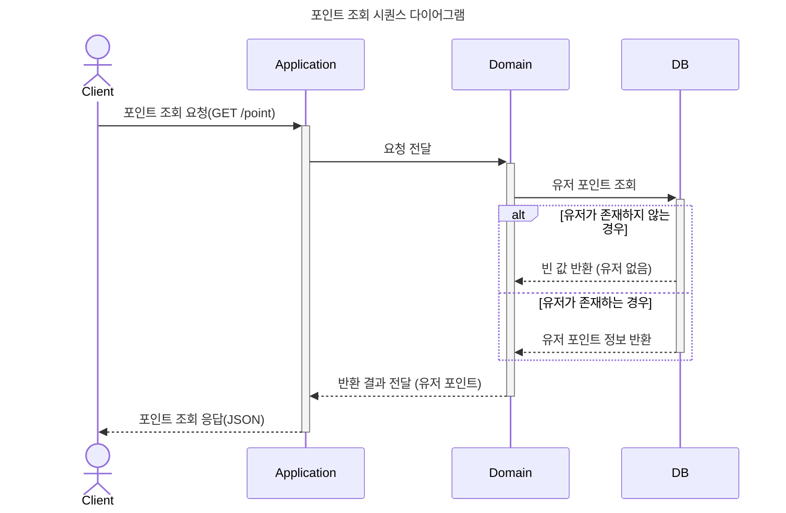
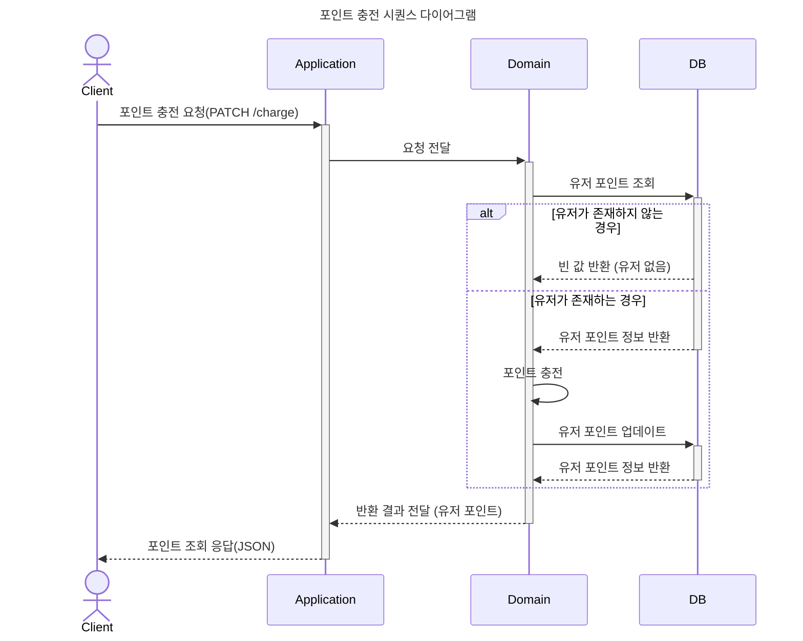
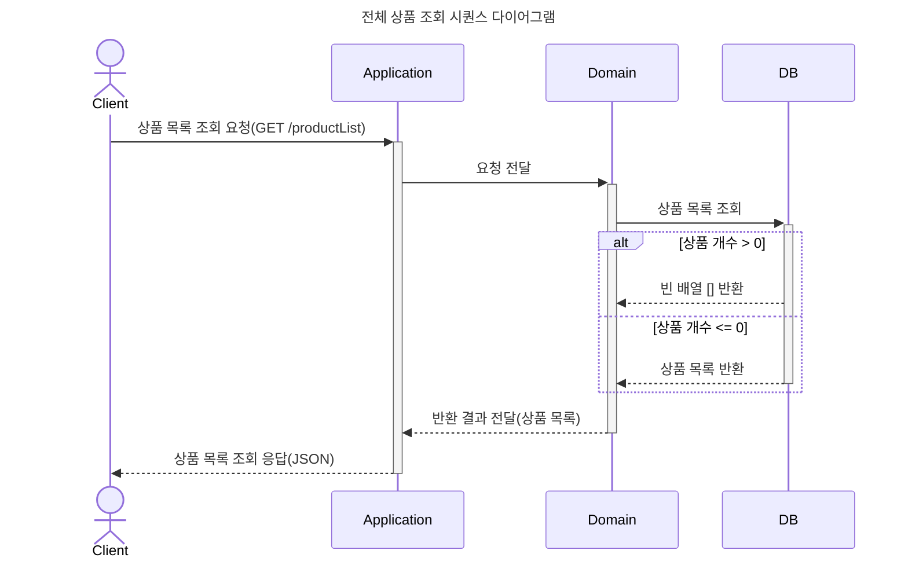
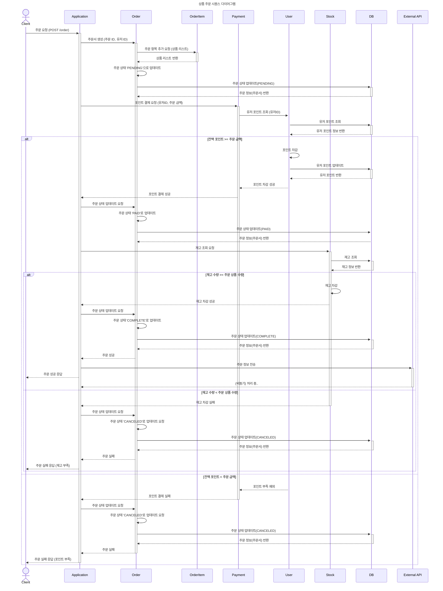

# e-commerce
이 프로젝트는 TDD(테스트 주도 개발)와 클린 아키텍처를 기반으로 구축한 이커머스 서버 애플리케이션입니다.
객체지향 설계 원칙(OCP, DIP)을 준수하며, 레이어드 아키텍처를 적용해 확장성과 유지보수성을 극대화했습니다.

추후 MSA(Microservices Architecture)로 확장 가능하도록 도메인 분리를 고려해 설계했습니다.

## 주요 특징
- TDD 적용 : 모든 비즈니스 로직은 테스트 주도 개발 방식을 통해 설계 및 구현
- Layered + Clean Architecture : 도메인 중심 설계로 애플리케이션 핵심 로직을 보호하고 외부와 분리
- OCP, DIP 준수
- MSA 전환 고려한 설계
  - 도메인 중심 설계와 DTO(Data Transfer Object)를 사용하여 서비스 간 독립성 확보
  - 이벤트 기반 통신 구조를 도입해 비동기 메시징 방식으로 확장 가능
  - 개별 도메인의 상태 및 데이터 관리가 독립적으로 수행될 수 있도록 설계
- 데이터 무결성 보장: 재고 관리와 주문 처리의 동시성 문제를 고려하여 설계

--- 
## Progress
- ### [기술 스택](#tech-stack)
- ### [요구 사항](#requirements)
- ### [시나리오 설계](#1-시나리오-설계)
    + #### [주요 기능](#1-1-주요-기능)
    + #### [시퀀스 다이어그램](#1-2-시퀀스-다이어그램-작성)
    + #### [ERD 설계](#1-3-erd-설계)
- ### [API Specsification](#2-api-specification)
    + #### [Swagger](#2-1-swagger-접속)
- ### [Deep Dive](#3-deep-dive)
---


## Tech Stack
- Backend: Java, Spring Boot
- Database: MariaDB
- Cache & Concurrency Control: Redis, Redisson, DB Lock(Optimistic Lock)
- Build Tool: Gradle
- Testing: JUnit5, AssertJ
- Containerization: Docker
- Version Control: Git

---

## Requirements
- 아래 4가지 API 를 구현한다.
    - 잔액 충전 / 조회 API
    - 상품 조회 API
    - 주문 / 결제 API
    - 인기 판매 상품 조회 API
- 다수의 인스턴스로 어플리케이션이 동작하더라도 기능에 문제가 없도록 한다.
- 동시성 이슈를 고려하여 구현한다.


---


## 1. 시나리오 설계
### 1-1 주요 기능

1️⃣ 잔액 충전 / 조회 API

- 결제에 사용될 금액을 충전하는 API 를 작성한다.
- 사용자 식별자 및 충전할 금액을 받아 잔액을 충전한다.
- 사용자 식별자를 통해 해당 사용자의 잔액을 조회한다.

2️⃣ 상품 조회 API

- 상품 정보 ( ID, 이름, 가격, 잔여수량 ) 을 조회하는 API 를 작성한다.

3️⃣ 주문 / 결제 API

- 사용자 식별자와 (상품 ID, 수량) 목록을 입력받아 주문하고 결제를 수행하는 API 를 작성한다.
- 결제는 기 충전된 잔액을 기반으로 수행하며 성공할 시 잔액을 차감한다.
- 데이터 분석을 위해 결제 성공 시에 실시간으로 주문 정보를 외부 어플리케이션에 전송한다.

4️⃣ 상위 상품 조회 API
- 최근 3일간 가장 많이 팔린 상위 5개 상품 정보를 제공하는 API

```
  💡 KEY POINT
```
- 동시에 여러 주문이 들어올 경우, 유저의 보유 잔고에 대한 처리가 정확해야 한다.
- 각 상품의 재고 관리가 정상적으로 이루어져 잘못된 주문이 발생하지 않도록 해야 한다.

### 1-2 시퀀스 다이어그램 작성
*  잔액 충전 / 조회 API</br>



* 상품 조회 API</br>

* 주문 / 결제 API</br>


* 상위 상품 조회 API</br>

* 장바구니에 상품 조회/추가/삭제 API (심화)


### 1-3 ERD 설계
* ERD 작성
  


## 2. API specification
### 2-1 Swagger 접속
 - http://localhost:8080/swagger-ui/index.html

## 3. Deep Dive

## 4. Manual
1. application.yml에서 데이터베이스 설정 수정. 
2. Docker, docker-compose를 사용해 애플리케이션을 컨테이너로 실행
   - /docs/docker 위치에서 docker-compose up --build
3. DB 실행 및 연결 확인
   - host : localhost
   - port : 13306
4. API 테스트
   - http://localhost:8080/swagger-ui/index.html
