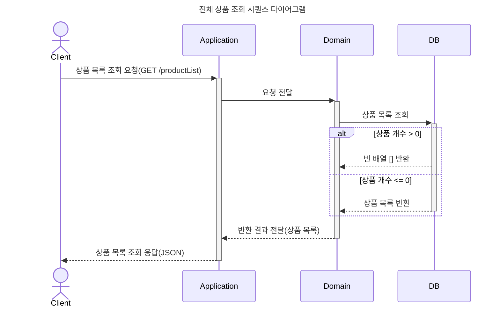

```mermaid
---
title: 전체 상품 조회 시퀀스 다이어그램
---
sequenceDiagram
    actor c as Client
    participant app as Application
    participant domain as Domain
    participant db as DB
    
    c->>+app: 상품 목록 조회 요청(GET /productList)
    app->>+domain: 요청 전달
    domain->>+db: 상품 목록 조회
    alt 상품 개수 > 0
        db-->>domain: 빈 배열 [] 반환
    else 상품 개수 <= 0
        db-->>-domain: 상품 목록 반환
    end
    domain-->>-app: 반환 결과 전달(상품 목록)
    app-->>-c: 상품 목록 조회 응답(JSON)
```