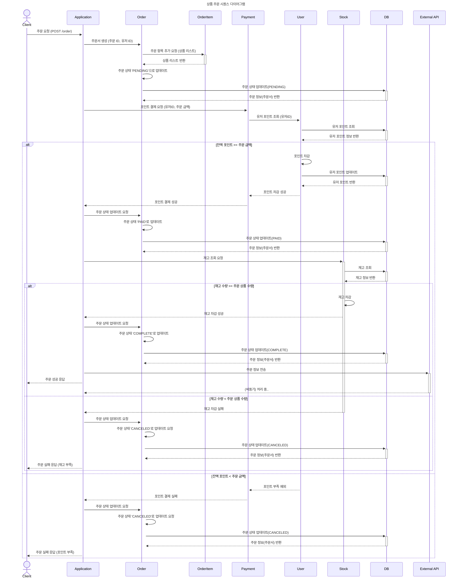

```mermaid
---
title: 상품 주문 시퀀스 다이어그램
---
sequenceDiagram
    actor c as Client
    participant app as Application
    participant order as Order
    participant item as OrderItem
    participant pay as Payment
    participant user as User
    participant stock as Stock
    participant db as DB
    participant api as External API
    
    c->>+app: 주문 요청 (POST /order)
    app->>+order: 주문서 생성 (주문 ID, 유저 ID)
    order->>+item: 주문 항목 추가 요청 (상품 리스트)
    item-->>-order: 상품 리스트 반환
    order->>order: 주문 상태 'PENDING'으로 업데이트 
    order->>+db: 주문 상태 업데이트(PENDING)
    db-->>-order: 주문 정보(주문서) 반환
    
    app->>+pay: 포인트 결제 요청 (유저ID, 주문 금액)
    pay->>+user: 유저 포인트 조회 (유저ID)
    user->>+db: 유저 포인트 조회
    db-->>-user: 유저 포인트 정보 반환
    
    alt 잔액 포인트 >= 주문 금액
        user->>user: 포인트 차감
        user->>+db: 유저 포인트 업데이트
        db-->>-user: 유저 포인트 반환
        user-->>pay: 포인트 차감 성공
        pay-->>app: 포인트 결제 성공
        app->>order: 주문 상태 업데이트 요청
        order->>order: 주문 상태 'PAID'로 업데이트
        order->>+db: 주문 상태 업데이트(PAID)
        db-->>-order: 주문 정보(주문서) 반환
        
        app->>+stock: 재고 조회 요청
        stock->>+db: 재고 조회
        db-->>-stock: 재고 정보 반환
        
        alt 재고 수량 >= 주문 상품 수량
            stock->>stock: 재고 차감
            stock-->>app: 재고 차감 성공
            app->>+order: 주문 상태 업데이트 요청
            order->>order: 주문 상태 'COMPLETE'로 업데이트
            order->>+db: 주문 상태 업데이트(COMPLETE)
            db-->>-order: 주문 정보(주문서) 반환
            app->>+api: 주문 정보 전송
            app-->>c: 주문 성공 응답
            api-->>-app: (비동기) 처리 중..
        else 재고 수량 < 주문 상품 수량
            stock-->>-app: 재고 차감 실패
            app->>+order: 주문 상태 업데이트 요청
            order->>order: 주문 상태 'CANCELED'로 업데이트 요청
            order->>+db: 주문 상태 업데이트(CANCELED)
            db-->>-order: 주문 정보(주문서) 반환
            app-->>c: 주문 실패 응답 (재고 부족)
        end
        
    else 잔액 포인트 < 주문 금액
        user-->>pay: 포인트 부족 예외
        pay-->>app: 포인트 결제 실패
        app->>+order: 주문 상태 업데이트 요청
        order->>order: 주문 상태 'CANCELED'로 업데이트 요청
        order->>+db: 주문 상태 업데이트(CANCELED)
        db-->>-order: 주문 정보(주문서) 반환
        app-->>c: 주문 실패 응답 (포인트 부족)
    end
```