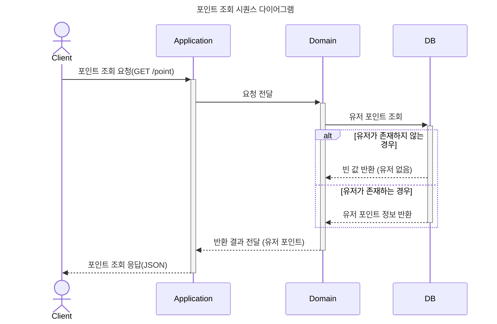

```mermaid
---
title: 포인트 조회 시퀀스 다이어그램
---
sequenceDiagram
    actor c as Client
    participant app as Application
    participant domain as Domain
    participant db as DB
    
    c->>+app: 포인트 조회 요청(GET /point)
    app->>+domain: 요청 전달
    domain->>+db: 유저 포인트 조회
    alt 유저가 존재하지 않는 경우
        db-->>domain: 빈 값 반환 (유저 없음)
    else 유저가 존재하는 경우
        db-->>-domain: 유저 포인트 정보 반환
    end
    domain-->>-app: 반환 결과 전달 (유저 포인트)
    app-->>-c: 포인트 조회 응답(JSON)
```